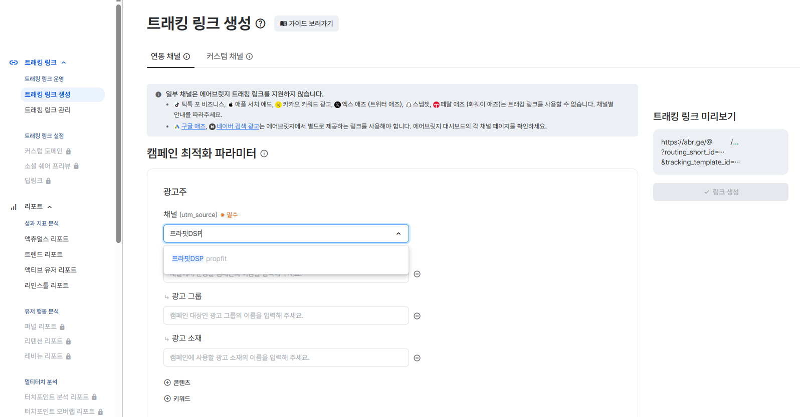
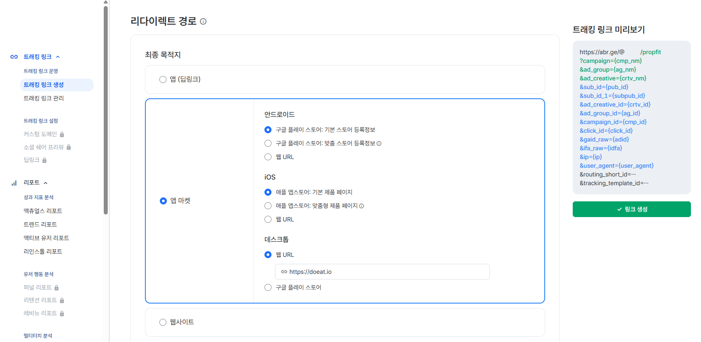
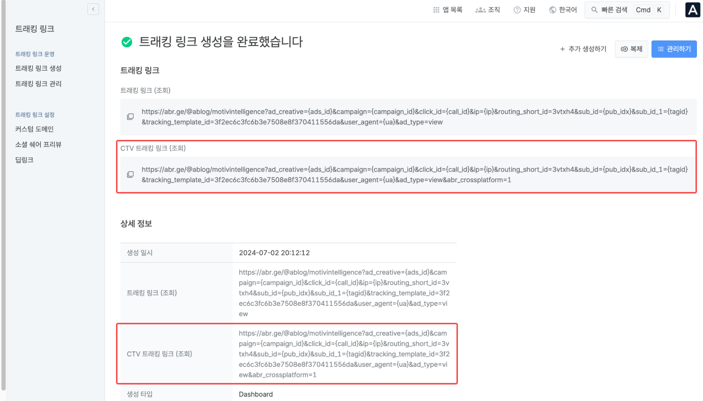
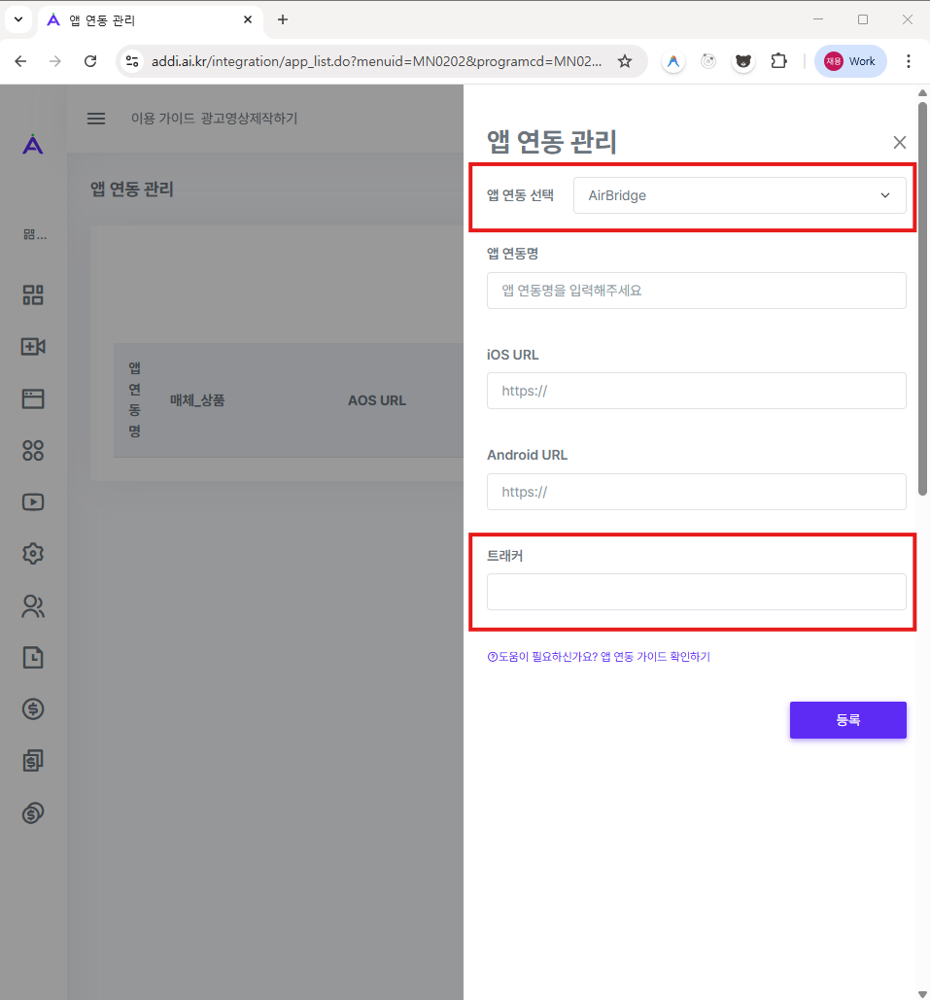
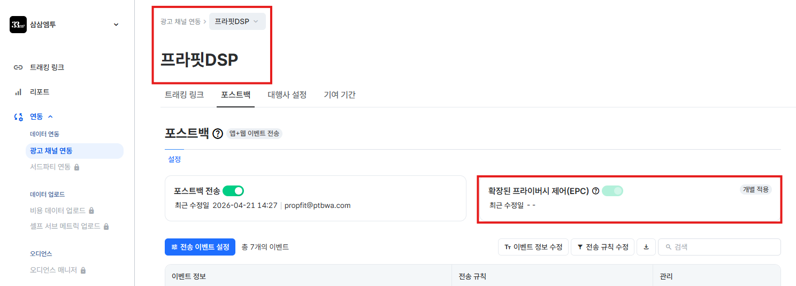
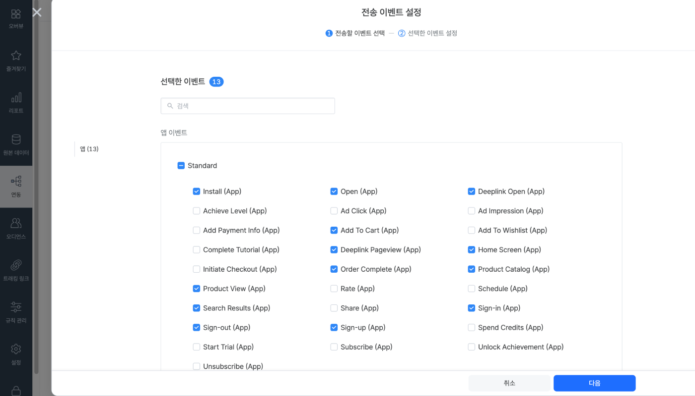

# Addirect(애디렉트) 연동 가이드 for Airbridge v1.0

---

- [1. 연동 안내](#1-연동-안내)
- [2. 트래킹 링크 생성 방법](#2-트래킹-링크-생성-방법)
  - [2.1. 트래킹 링크 생성 메뉴 진입](#21-트래킹-링크-생성-메뉴-진입)
  - [2.2. 연동 채널 선택 및 최적화 파라미터 설정](#22-연동-채널-선택-및-최적화-파라미터-설정)
- [3. 트래킹 링크 확인 및 복사](#3-트래킹-링크-확인-및-복사)
  - [3.1. 링크 생성 완료 및 기본 항목 확인](#31-링크-생성-완료-및-기본-항목-확인)
  - [3.2. CTV 트래킹 링크 선택 및 복사](#32-ctv-트래킹-링크-선택-및-복사)
- [4. Addirect 앱 연동 관리 등록](#4-addirect-앱-연동-관리-등록)
- [5. Airbridge 포스트백 설정하기](#5-airbridge-포스트백-설정하기)
  - [5.1. 포스트백 설정 메뉴 진입](#51-포스트백-설정-메뉴-진입)
  - [5.2. 포스트백 전송 활성화 및 이벤트 선택](#52-포스트백-전송-활성화-및-이벤트-선택)
  - [5.3. 이벤트 정보 및 전송 규칙 설정](#53-이벤트-정보-및-전송-규칙-설정)
  - [5.4. 포스트백 적용 및 확인](#54-포스트백-적용-및-확인)
- [6. 참조 문서](#6-참조-문서)

---

<br><br>

## 1. 연동 안내

> 이 문서는 광고주가 에어브릿지(Airbridge) 대시보드에서 Addirect(애디렉트) 데이터 트래킹용 링크를 생성하고, 이를 당사 애디렉스 서비스에 등록하여 최종 연동하는 과정을 설명합니다.

<br><br>

## 2. 트래킹 링크 생성 방법

### 2.1. 트래킹 링크 생성 메뉴 진입

Airbridge 대시보드 로그인 후, 좌측 메뉴 목록에서 **`트래킹 링크 > 트래킹 링크 생성`** 메뉴를 클릭합니다.

### 2.2. 연동 채널 선택 및 최적화 파라미터 설정

1. 트래킹 링크 생성 화면 상단에서 **`연동 채널`** 탭이 선택되어 있는지 확인합니다.
2. 하단의 **캠페인 최적화 파라미터 > 광고주** 영역 내 `채널 (utm_source) * 필수` 입력칸을 클릭합니다.
3. 드롭다운 목록이나 검색을 통해 **`프라핏DSP`** 을 찾아 선택합니다.



4. 채널을 `프라핏DSP`로 선택하면 아래 표와 같이 **캠페인, 광고 그룹, 광고 소재** 항목이 프리셋(Preset) 값으로 자동 세팅됩니다.

> ⚠️ **주의**: 미리 매핑된 프리셋(Preset) 파라미터는 지정된 addirect 데이터를 수집하므로 **그대로 사용할 것을 권장**합니다. 임의로 수정하면 데이터 수집이 정상적으로 이루어지지 않을 수 있습니다.

| 항목      | 파라미터       | 프리셋 값   | 설명                                                    | 비고                 |
| --------- | -------------- | ----------- | ------------------------------------------------------- | -------------------- |
| 채널      | `utm_source`   | `프라핏DSP` | 트래킹 링크를 사용할 광고 채널입니다.                   | **필수** (직접 선택) |
| 캠페인    | `utm_campaign` | `{cmp_nm}`  | Addirect(애디렉트)의 캠페인명이 자동으로 매핑됩니다.    | Preset (자동 세팅)   |
| 광고 그룹 | `ad_group`     | `{ag_nm}`   | Addirect(애디렉트)의 광고 그룹명이 자동으로 매핑됩니다. | Preset (자동 세팅)   |
| 광고 소재 | `ad_creative`  | `{crtv_nm}` | Addirect(애디렉트)의 광고 소재명이 자동으로 매핑됩니다. | Preset (자동 세팅)   |
| 콘텐츠    | `content`      | -           | 콘텐츠 관련 식별 정보를 필요 시 입력합니다.             | 선택 (수동 입력)     |
| 키워드    | `keyword`      | -           | 광고에 연결된 키워드를 필요 시 입력합니다.              | 선택 (수동 입력)     |

5. 필요에 따라 하단의 **리다이렉트 경로** 섹션에서 유저가 광고를 클릭 시 이동할 최종 목적지를 설정합니다. 앱 (딥링크), 앱 마켓, 웹사이트 중 선택할 수 있으며, 운영체제(Android/iOS)와 데스크톱별로 개별 설정이 가능합니다.
6. 모든 설정이 완료되면 화면 우측 **트래킹 링크 미리보기** 박스 하단의 **`✔ 링크 생성`** 버튼을 클릭합니다.



<br><br>

## 3. 트래킹 링크 확인 및 복사

### 3.1. 링크 생성 완료 및 기본 항목 확인

링크 생성이 성공적으로 이루어지면 **`✔ 트래킹 링크 생성을 완료했습니다`** 메시지와 함께 생성된 링크 내역 및 상세 정보를 안내하는 화면으로 이동합니다.



해당 화면에서는 아래의 항목들을 확인할 수 있습니다.

| 항목                                   | 설명                                                                                                                                                      |
| -------------------------------------- | --------------------------------------------------------------------------------------------------------------------------------------------------------- |
| 트래킹 링크 (조회)                     | 일반적인 모바일·웹 환경에서 범용 사용되는 기본 어트리뷰션 트래킹 링크입니다.                                                                              |
| **CTV 트래킹 링크 (조회)**             | **Connected TV(스마트TV·셋톱박스 등) 환경에 최적화된 트래킹 링크입니다. `abr_crossplatform=1` 파라미터가 포함되어 크로스 플랫폼 성과 추적을 지원합니다.** |
| 상세 정보 > 생성 일시                  | 트래킹 링크가 생성된 날짜·시각 정보입니다.                                                                                                                |
| 상세 정보 > 트래킹 링크 (조회)         | 파라미터가 포함된 전체 트래킹 링크 전문을 확인할 수 있습니다.                                                                                             |
| **상세 정보 > CTV 트래킹 링크 (조회)** | **파라미터가 포함된 전체 CTV 트래킹 링크 전문을 확인할 수 있습니다.**                                                                                     |
| 상세 정보 > 생성 타입                  | 트래킹 링크의 생성 경로(예: `Dashboard`)를 표시합니다.                                                                                                    |

> 우측 상단에는 `+ 추가 생성하기`, `복제`, `관리하기` 버튼이 제공되어 추가 링크 생성 및 기존 링크 관리가 가능합니다.

### 3.2. CTV 트래킹 링크 선택 및 복사

당사 DSP 연동을 위해서는 일반 트래킹 링크가 아닌 **CTV 트래킹 링크**를 사용해야 합니다.

> ⚠️ **중요**: 반드시 **`CTV 트래킹 링크 (조회)`** 항목의 URL을 복사하세요. 일반 `트래킹 링크 (조회)`가 아닌 점에 유의해 주세요.

1. 트래킹 링크 생성 완료 화면 또는 상세 정보 영역에서 **`CTV 트래킹 링크 (조회)`** 항목을 찾습니다.
2. 해당 항목 좌측의 **복사 아이콘(📋)** 을 클릭하여 CTV 트래킹 링크 전체 URL을 클립보드에 복사합니다.
3. 복사한 CTV 트래킹 링크 URL은 아래와 같은 형태입니다:

```
https://abr.ge/@[service]/motivintelligence?ad_creative={ads_id}&campaign={campaign}&click_id={call_id}&ip={ip}&routing_short_id=3vtxh4&sub_id={pub_idx}&sub_id_1={tagid}&tracking_template_id=3f2ec6c3fc6b3e7508e8f370411556da&user_agent={ua}&ad_type=view&abr_crossplatform=1
```

> 💡 **참고**: URL 내 `@[service]` 부분에는 Airbridge 대시보드에서 설정한 서비스(앱) 이름이 자동으로 들어갑니다. 서비스마다 해당 값이 다르므로 실제 생성된 링크를 그대로 사용하시면 됩니다.

<br><br>

## 4. Addirect 앱 연동 관리 등록

앞서 Airbridge 대시보드에서 복사한 **CTV 트래킹 링크**를 Addirect(애디렉트)에 최종 등록하여 연동을 완료합니다.



1. Addirect 플랫폼에 로그인 후, **`앱 연동 관리`** 메뉴로 진입합니다.
2. **앱 연동 선택**: 상단 드롭다운에서 **`AirBridge`** 를 선택합니다.
3. **앱 연동명**: 연동을 식별할 수 있는 이름을 입력합니다.
4. **iOS URL / Android URL**: 대상 앱의 스토어 URL을 각각 입력합니다.
5. **트래커**: 하단의 **`트래커`** 입력란에 앞서 복사한 **CTV 트래킹 링크** 를 그대로 붙여넣습니다.
6. 하단의 **`등록`** 버튼을 클릭하여 연동을 최종 완료합니다.

<br><br>

## 5. Airbridge 포스트백 설정하기

Addirect 앱 연동 등록이 완료되면, Airbridge에서 해당 광고 채널의 **포스트백 전송**을 설정하여 이벤트 데이터를 Addirect로 전달할 수 있습니다.

### 5.1. 포스트백 설정 메뉴 진입

1. Airbridge 대시보드에서 앞서 트래킹 링크 생성 시 선택한 **`프라핏DSP`** 광고 채널 상세 화면으로 이동합니다.
2. 상단 탭에서 **`포스트백 > 설정`** 메뉴를 선택합니다.
3. **`확장된 프라이버시 제어(EPC)`** 항목이 활성화되어 있다면 토글을 눌러 **비활성화**합니다.
4. 일부 광고 채널은 포스트백 설정 전에 별도 인증 정보 등록이 필요할 수 있습니다. 화면 우측에 **`인증 정보 관리`** 가 노출된다면, 채널 가이드에 따라 인증 정보를 먼저 등록합니다.



> 💡 **참고**: Airbridge에서 포스트백 설정이 가능한 범위는 사용자 권한에 따라 다를 수 있습니다. 일반적으로 오너 계정과 사내 마케터 계정은 설정할 수 있으며, 대행사 계정은 광고 채널 데이터 권한이 있어야 합니다.

> ⚠️ **중요**: **확장된 프라이버시 제어(Enhanced Privacy Control, EPC)** 는 iOS 14.5 이상 환경에서 ATT에 동의하지 않은 유저의 데이터를 외부 채널이나 서비스와 공유하지 않도록 보호하는 기능입니다. EPC가 활성화되어 있으면 식별자를 포함한 유저 데이터가 포스트백으로 전달되지 않을 수 있으므로, Addirect 연동 시에는 **비활성화 상태로 설정하는 것을 권장**합니다.

### 5.2. 포스트백 전송 활성화 및 이벤트 선택

1. **`포스트백 전송`** 토글을 활성화한 뒤, **`전송 이벤트 설정`** 버튼을 클릭합니다.
2. **`전송할 이벤트 선택`** 단계에서 Addirect로 전송할 이벤트를 선택합니다.
3. 이벤트 목록에는 Airbridge에서 **실제로 수집된 이벤트만** 표시됩니다. 필요한 이벤트가 보이지 않는다면 먼저 앱에서 해당 이벤트가 수집되고 있는지 확인합니다.
4. 최소 1개 이상의 이벤트를 선택한 후 **`다음`** 버튼을 클릭합니다.



> ⚠️ **주의**: 이벤트를 하나도 선택하지 않으면 `포스트백 전송` 토글이 활성화되어 있어도 실제 포스트백 전송은 시작되지 않습니다.

### 5.3. 이벤트 정보 및 전송 규칙 설정

선택한 이벤트별로 **이벤트 정보**와 **전송 규칙**을 설정합니다.

1. **`이벤트 정보 수정`** 에서 광고 채널에 전달할 이벤트명을 검토합니다.
2. 지원되는 채널이라면 이벤트별 **매출 포함 여부**도 함께 설정합니다.
3. **`전송 규칙 수정`** 에서 아래 항목을 운영 목적에 맞게 선택합니다.
4. 설정이 끝나면 **`저장`** 버튼을 클릭합니다.

| 항목           | 권장 설정              | 설명                                                                                             |
| -------------- | ---------------------- | ------------------------------------------------------------------------------------------------ |
| 채널 기여 여부 | `채널이 기여한 이벤트` | 해당 채널에 기여된 이벤트만 전송합니다. 일반적인 성과 측정이나 정산 목적에 적합합니다.           |
| 채널 기여 여부 | `모든 이벤트`          | 기여 여부와 관계없이 모든 이벤트를 전송합니다. 리타겟팅 최적화가 필요할 때 고려할 수 있습니다.   |
| 첫 이벤트 여부 | `첫 이벤트`            | 디바이스 기준 최초 발생 이벤트만 전송합니다. CPI/CPA 중심 운영에 적합합니다.                     |
| 첫 이벤트 여부 | `모든 이벤트`          | 반복 발생 이벤트까지 모두 전송합니다. 리인게이지먼트 또는 리타겟팅 최적화 시 활용할 수 있습니다. |

> 💡 **운영 팁**: 리타겟팅 캠페인 최적화 목적이라면 Airbridge 가이드 기준으로 **`채널 기여 여부 = 모든 이벤트`**, **`첫 이벤트 여부 = 모든 이벤트`** 조합을 검토할 수 있습니다.

> ⚠️ **주의**: 포스트백 URL 수정은 광고비 정산과 캠페인 최적화에 직접 영향을 줄 수 있으므로, 별도 수정이 필요한 경우 Addirect 담당자와 사전 협의 후 진행하는 것을 권장합니다.

### 5.4. 포스트백 적용 및 확인

1. 모든 이벤트 설정을 저장한 후 **`적용`** 버튼을 클릭합니다.
2. 적용이 완료되면 선택한 이벤트의 포스트백이 Addirect로 **즉시 전송**되기 시작합니다.
3. 이미 전송 중인 이벤트 설정을 수정한 경우에도, 변경 사항은 적용 직후 반영됩니다.
4. 초기 설정 후에는 Addirect 측에서 이벤트 수신 여부를 함께 확인하여 정상 연동 여부를 점검합니다.

<br><br>

## 6. 참조 문서

- [Airbridge - 대시보드에서 트래킹 링크 생성하기](https://help.airbridge.io/ko/guides/creating-tracking-links-on-the-dashboard)
- [Airbridge - 포스트백 설정하기](https://help.airbridge.io/ko/guides/postback-settings-new)
- [Addirect - 앱 연동 관리 가이드](https://addi-1.gitbook.io/guide/part-7./undefined-1)
